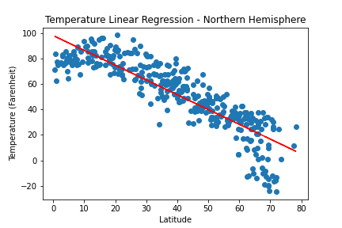
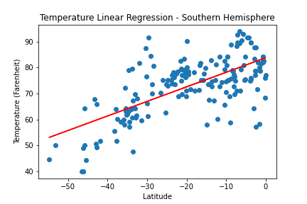

# Weather, Hotels, and APIs

This repo uses existing Python Libraries and public APIs to create maps visualizing a relationship between hotel locations and recorded weather data.
 
 
500+ cities were randomly generated using the <b>[CityPy](https://pypi.python.org/pypi/citipy)</b> Python Library. Using this list of cities and the <b>[OpenWeatherMap API](https://openweathermap.org/api)</b>, I generated a <b>[Pandas](https://pandas.pydata.org/)</b> dataframe of each cities' weather. Following this was an analysis of the data.
 
 
The analysis focused on:
- Temperature (Farenheit)
- Humidity
- Cloudiness
- Wind Speed (mph)
 
Separating the weather data by Northern Hemisphere cities and Southern Hemisphere cities allowed for potential observable trends unique to each.
 

## Data Analysis & Basic Visualization

In the <b>WeatherPy</b> notebook, this analysis takes the form scatterplots and linear regression models generated using the <b>[Matplotlib](https://matplotlib.org/)</b> Python Library. Trends and observations for each analysis included in the notebook.
 
 

| Northern Hemisphere Latitudes v. Temperature | Southern Hemisphere Latitudes v. Temperature |
|------|------|
|  |  |

## Map Generation

The <b>VacationPy</b> notebook uses the previous weather data to generate a <b>[Google heat map](https://developers.google.com/maps/documentation/javascript/heatmaplayer#:~:text=A%20heatmap%20is%20a%20visualization,lower%20intensity%20will%20appear%20green.)</b> as a visualization.
 
 

Conditions were passed through the weather data to create a data frame of cities suitable for vacations. These cities were passed through the <b>[Google Places API](https://developers.google.com/maps/documentation/places/web-service/overview)</b> to find suitable hotels. Markers were placed on the heatmap to display hotel locations.
 
 

## Conclustions

---
### Contact
LinkedIn | https://www.linkedin.com/in/niko-elvambuena/
 
Email | niko.elvambuena95@gmail.com
